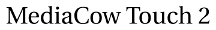

  

# MediaCow Touch 2
MediaCow Touch 2 "Paris" is the successor to MediaCow Touch (1) "Nashville" which is a DIY portable tablet computer.

This repository has all of the hardware designs and some software for the project.

See [MediaCow Touch 2 page](https://ctcl.lgbt/projects/mct2/) for more information.

